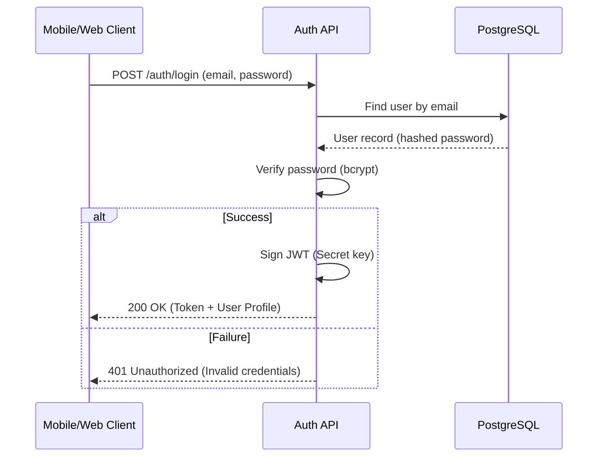

# API Reference

This domain contains the technical specifications for all internal and external APIs used in the Lattice ecosystem.

## API Philosophy

Our APIs are designed to be **developer-friendly**, **consistent**, and **performant**. We follow RESTful principles and use custom JWT-based identity management.

### Core Principles

1.  **JSON-First**: All request and response bodies MUST be valid JSON.
2.  **Resource-Oriented**: Endpoints are organized around resources (e.g., `/events`, `/pois`).
3.  **Authentication**: All sensitive endpoints REQUIRE a valid JSON Web Token (JWT) passed in the `Authorization` header.
4.  **Idempotency**: All `PUT` and `DELETE` operations are idempotent.
5.  **Error Handling**: We use standard HTTP status codes and provide descriptive error messages in a consistent format.

## Authentication

Lattice uses a **Custom JWT-based Authentication**. Clients must exchange user credentials (email/password) for a token via the `/auth/login` endpoint and include it in all protected requests.

**Header Format:**
```http
Authorization: Bearer <JWT_TOKEN>
```

### Authentication Flow



> [!IMPORTANT]
> Ensure your client handles token storage and expiration logic (standard 24h duration).

## Global Error Schema

All error responses follow this structure:

```json
{
  "error": "Short description of what went wrong",
  "code": "MACHINE_READABLE_ERROR_CODE",
  "details": {
    "field": "Additional context or validation errors"
  }
}
```

### Common Status Codes

| Code | Meaning | Description |
| :--- | :--- | :--- |
| `200` | OK | Request succeeded. |
| `201` | Created | Resource successfully created. |
| `400` | Bad Request | Invalid parameters or malformed body. |
| `401` | Unauthorized | Missing or invalid authentication token. |
| `403` | Forbidden | Authenticated but lacks permissions for the resource. |
| `404` | Not Found | The requested resource does not exist. |
| `429` | Too Many Requests | Rate limit exceeded. |
| `500` | Internal Server Error | Something went wrong on our end. |

## Available APIs

| API | Description | Target Audience |
| :--- | :--- | :--- |
| [Admin API](./admin-api.md) | Operations for platform management and telemetry. | Admin Dashboard |
| [Mobile API](./mobile-api.md) | Discovery and client-side interactions. | Mobile App (Lattice) |

## Data Formats

### Timestamp
All timestamps MUST be in ISO 8601 format (UTC).

### Location
Geospatial data MUST follow the **GeoJSON** standard: `[longitude, latitude]`.

---

> [!TIP]
> For local development, the API is usually available at `http://localhost:3001/api/v1`.
