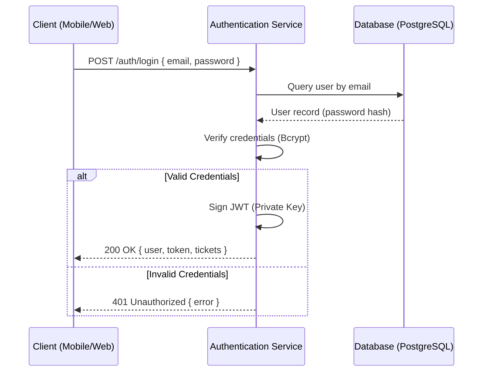

import { Callout } from 'nextra/components'

# API Reference

This technical domain contains detailed specifications for all internal and external APIs utilized within the Lattice ecosystem. The backend is comprised of a high-performance modular Express monolith with robust geospatial capabilities powered by PostGIS and database operations optimized via Drizzle ORM.

## API Philosophy

Our APIs are designed according to modern RESTful patterns, prioritizing real-time geospatial performance, data consistency, and seamless integration for client applications.

### Core Principles

1. **JSON-First**: All request and response bodies MUST strictly utilize the `application/json` media type.
2. **Resource-Oriented**: Endpoints are organized around logical resources (such as `/events`, `/pois`, `/saved`, or `/telemetry`).
3. **Integrated Security**: Protected endpoints require standard Bearer token authentication in the HTTP header.
4. **Idempotency**: Data mutation and deletion operations (`PUT`, `PATCH`, `DELETE`) are designed to be safe and idempotent.
5. **Unified Error Schema**: In the event of a failure, the API returns a structured, highly descriptive payload supporting machine-readable codes and user-friendly messaging.

---

## Authentication and Access Control

Lattice utilizes a **JSON Web Token (JWT)** authentication mechanism. Upon successful registration or login, clients receive a signed token which must be supplied on subsequent requests requiring authentication.

### Authorization Header

For all protected routes, include the following HTTP header:

```http
Authorization: Bearer <JWT_TOKEN>
```

### Authentication Flow



<Callout type="warning">
  Issued tokens are subject to standard expiration windows. Client applications must implement secure credential storage and handle token expiration gracefully to avoid abrupt user redirection.
</Callout>

---

## Global Error Schema

All platform errors return a standardized, strongly-typed JSON structure to facilitate seamless handling in frontend clients:

```json
{
  "error": {
    "code": "INVALID_INPUT",
    "message": "Email and password are required",
    "user_friendly_message": "Email and password are required.",
    "status": 400
  }
}
```

### Error Object Fields

| Field | Type | Description |
| :--- | :--- | :--- |
| `code` | `string` | Unique identifier for the error type, designed for client-side control flow. |
| `message` | `string` | Technical details regarding the failure, tailored for developer debugging. |
| `user_friendly_message` | `string` | Optional. Safe, localized string intended for direct rendering to end-users. |
| `status` | `number` | The HTTP status code duplicated in the payload for client convenience. |

### Common HTTP Status Codes

| Code | Meaning | Description |
| :--- | :--- | :--- |
| `200` | OK | Request completed successfully and returned the requested payload. |
| `201` | Created | Resource successfully initialized on the server (e.g., Event, POI, Ticket). |
| `204` | No Content | Action executed successfully (common in deletions) with an empty response body. |
| `400` | Bad Request | Invalid parameters, malformed request body, or spatial validation failure. |
| `401` | Unauthorized | Missing authentication token or the supplied token has expired. |
| `403` | Forbidden | Authenticated successfully, but lacks necessary privileges to access the resource. |
| `404` | Not Found | The requested geospatial or identity resource could not be found. |
| `429` | Too Many Requests | Rate limiting thresholds exceeded at the Express monolith level. |
| `500` | Internal Error | Unexpected server error. An internal log is compiled for diagnostic analysis. |

---

## Available APIs and Modules

The Lattice API is modularized to support long-term maintainability and system scalability:

| Section | Purpose | Primary Target |
| :--- | :--- | :--- |
| [Mobile API](./mobile-api.md) | Routes optimized for discovery, pedestrian navigation, tickets, and user profiles. | Mobile Client (React Native/Expo) |
| [Admin API](./admin-api.md) | High-privilege operations, spatial curation, and active crowd telemetry. | Control Panel (Next.js) |
| [Data Schemas](./schemas.md) | Standardized schemas, database models, spatial objects, and enumerations. | Shared (Mobile, Web, Server) |

---

## Data Standards and Formats

To guarantee data uniformity across all clients, the following formatting rules are enforced:

### Date and Time

All timestamps are serialized as **ISO 8601** strings with global UTC encoding:

```json
"startDate": "2026-05-20T10:00:00.000Z"
```

### Geospatial Data

Geospatial data parsed and returned by the platform strictly follows the **GeoJSON (RFC 7946)** specification. The internal projection model utilizes the standard **WGS 84 (SRID 4326)** coordinate reference system.

Coordinates are always structured in the standard cartographic sequence:
`[longitude, latitude]`

```json
{
  "type": "Point",
  "coordinates": [2.1734, 41.3851]
}
```

<Callout type="info">
  For local development, the monolith API is typically exposed on port 3001. The base URL for all endpoints is `/api/v1` or as mounted directly on the monolith routes.
</Callout>
