import { useState, useRef, useEffect } from 'react'

export const ZoomableMermaid = ({ children }) => {
  const containerRef = useRef(null);
  const [scale, setScale] = useState(0.85);
  const [position, setPosition] = useState({ x: 0, y: 0 });
  const [isDragging, setIsDragging] = useState(false);
  const [dragStart, setDragStart] = useState({ x: 0, y: 0 });
  const [isFullscreen, setIsFullscreen] = useState(false);

  const handleWheel = (e) => {
    e.preventDefault();
    const zoomFactor = 0.08;
    const direction = e.deltaY < 0 ? 1 : -1;
    const newScale = Math.min(Math.max(scale + direction * zoomFactor, 0.2), 4);
    setScale(newScale);
  };

  const handleMouseDown = (e) => {
    if (e.button !== 0) return;
    setIsDragging(true);
    setDragStart({ x: e.clientX - position.x, y: e.clientY - position.y });
  };

  const handleMouseMove = (e) => {
    if (!isDragging) return;
    setPosition({
      x: e.clientX - dragStart.x,
      y: e.clientY - dragStart.y
    });
  };

  const handleMouseUp = () => {
    setIsDragging(false);
  };

  useEffect(() => {
    const el = containerRef.current;
    if (!el) return;
    const preventScroll = (e) => {
      e.preventDefault();
    };
    el.addEventListener('wheel', preventScroll, { passive: false });
    return () => el.removeEventListener('wheel', preventScroll);
  }, []);

  return (
    

      

        <button 
          type="button"
          onClick={() => setScale(prev => Math.min(prev + 0.15, 4))}
          style={{
            background: 'none',
            border: 'none',
            color: '#fff',
            fontSize: '18px',
            cursor: 'pointer',
            padding: '4px 10px',
            borderRadius: '6px',
            transition: 'background 0.2s',
          }}
        >+</button>
        <button 
          type="button"
          onClick={() => setScale(prev => Math.max(prev - 0.15, 0.2))}
          style={{
            background: 'none',
            border: 'none',
            color: '#fff',
            fontSize: '18px',
            cursor: 'pointer',
            padding: '4px 12px',
            borderRadius: '6px',
            transition: 'background 0.2s',
          }}
        >-</button>
        
          {Math.round(scale * 100)}%
        
        <button 
          type="button"
          onClick={() => { setScale(0.85); setPosition({ x: 0, y: 0 }); }}
          style={{
            background: 'none',
            border: 'none',
            color: '#fff',
            fontSize: '11px',
            fontWeight: '600',
            textTransform: 'uppercase',
            cursor: 'pointer',
            padding: '6px 10px',
            borderRadius: '6px',
            transition: 'background 0.2s',
          }}
        >Reset</button>
        <button 
          type="button"
          onClick={() => setIsFullscreen(!isFullscreen)}
          style={{
            background: 'none',
            border: 'none',
            color: '#fff',
            fontSize: '11px',
            fontWeight: '600',
            textTransform: 'uppercase',
            cursor: 'pointer',
            padding: '6px 10px',
            borderRadius: '6px',
            transition: 'background 0.2s',
          }}
        >
          {isFullscreen ? 'Exit' : 'Full Screen'}
        </button>
      

      

        💡 Scroll over diagram to Zoom | Left-click + Drag to Pan
      

      

        

          {children}
        

      

    

  )
}

# Mobile Activity Diagram

This diagram comprehensively describes the dynamic workflows and real state transitions of the **Lattice Mobile Application**, derived directly from the TypeScript source code. It models the launch sequence, dual-canvas sliding dashboard transitions, snap search island behavior, route planning, active navigation, and the adaptive AR viewfinder HUD.

## Mobile App Workflows

```mermaid
flowchart TD
    %% 1. Startup & Prep
    Start(["App Opened"]) --> NavigationReady{"Navigation State Ready?"}
    NavigationReady -- No --> WaitNav["Wait for navigationState.key"] --> NavigationReady
    NavigationReady -- Yes --> Prefetch["Launch Data Pre-fetch: events-search & POIs"]
    Prefetch --> TimeoutCheck{"Pre-fetch complete\nor 5s Safety Timeout?"}
    TimeoutCheck -- Yes --> SetDataReady["Set isDataReady = true"]
    SetDataReady --> CheckAuth{"Session Token or\nGuest Mode active?"}

    %% 2. Auth & Onboarding Branching
    CheckAuth -- Yes --> GoToMain["replace /(main)"]
    CheckAuth -- No --> GoToOnboarding["replace /(auth)/onboarding"]

    %% Onboarding Flow
    subgraph Onboarding ["Onboarding Screen"]
        GoToOnboarding --> ViewSlides["View Slides 1-3 with motion interpolations"]
        ViewSlides --> ActionSelect{"User Action"}
        ActionSelect -- "Continue as Guest" --> SetGuest["setGuestMode_true & setLastScreenMode_0"]
        SetGuest --> GoToMain
        ActionSelect -- "Get Started" --> GoToLogin["push /(auth)/login"]
    end

    subgraph Authentication ["Authentication Screen"]
        GoToLogin --> LoginSelect{"Auth Mode"}
        LoginSelect -- "Social Auth" --> GoogleApple["Google / Apple SSO"]
        LoginSelect -- "Email Login" --> EmailScreen["Email Credentials"]
        GoogleApple --> VerifySuccess{"Verify Success?"}
        EmailScreen --> VerifySuccess
        VerifySuccess -- Yes --> ClearGuest["setGuestMode_false"] --> GoToMain
        VerifySuccess -- No --> LoginError["Show Alert Error"] --> LoginSelect
    end

    %% 3. Main Dashboard Layout
    subgraph MainDashboard ["Main Canvas Dashboard"]
        GoToMain --> CheckScreenMode{"screenMode.value"}
        
        %% Explore Mode
        CheckScreenMode -- "0 (Explore)" --> RendersExplore["Renders DiscoveryFeed"]
        RendersExplore --> ClickFeedItem["Click Event/POI Item"]
        ClickFeedItem --> SwitchToMap["Auto-switch screenMode.value to 1"]
        
        %% Map Mode
        CheckScreenMode -- "1 (Map)" --> RendersMap["Renders MapContent via MapLibreGL"]
        SwitchToMap --> RendersMap
        
        %% Mode Toggle Action
        RendersMap --> DragToggle["Drag/Press Bottom-Left Mode Pill"]
        DragToggle --> SwitchToExplore["Switch screenMode.value to 0"]
        SwitchToExplore --> RendersExplore
    end

    %% 4. Top Search Island & Drawer Gestures
    subgraph SearchIsland ["Top Search Island Drawer"]
        RendersMap --> DetectPan["Detect Gesture.Pan on Search Island"]
        DetectPan --> SnapLevels{"Evaluate Drag Snaps"}
        
        SnapLevels -- "Level 1 (islandState = 0.0)" --> CollapsedSearch["Collapsed Search Bar + Profile Button"]
        SnapLevels -- "Level 2 (islandState = 0.5)" --> DashboardSearch["Renders DiscoveryDashboard: categories & recommended POIs"]
        SnapLevels -- "Level 3 (islandState = 1.0)" --> FullSearch["Renders SearchExperience: query typing & search history"]
        
        %% Anti-Skip Protection
        DetectPan -.-> AntiSkip["Anti-Skip Constraint: Forces user to drag through 0.5 first"]
        
        %% Profile sheet accessibility trigger
        CollapsedSearch --> ClickProfile["Press Profile Button"]
        ClickProfile --> ProfileSheet["Slide-out ProfileSheet"]
        ProfileSheet --> AccessibilityToggles["Configure Toggles: Avoid Stairs / Avoid Crowds / Wheelchair Mode"]
    end

    %% 5. Event Detail & Route Planning Sheets
    subgraph RoutePlanning ["Route Selection & Planning"]
        RendersMap --> TapMapMarker["Tap Event/POI Marker"]
        TapMapMarker --> OpenDetail["Open EventDetailSheet / POI Drawer"]
        OpenDetail --> ClickDirections["Click Get Directions"]
        
        ClickDirections --> PlanningMode["Transition UIState to MapUIState.PLANNING"]
        PlanningMode --> OpenPlanning["Open RoutePlanningSheet"]
        OpenPlanning --> FetchRoutes["Concurrent Route Fetch: driving, walking & bicycle"]
        FetchRoutes --> DisplayRouteVariants["Render route path options & ETAs"]
        DisplayRouteVariants --> SelectTransport["Change Transport Mode Profile"]
    end

    %% 6. Active Navigation Flow
    subgraph ActiveNavigation ["Active Guidance Mode"]
        DisplayRouteVariants --> ClickStartNav["Click Start Navigation"]
        ClickStartNav --> StartNavStore["trigger startNavigation store action"]
        
        StartNavStore --> UpdateNavState["isPlanning = false, isNavigating = true"]
        UpdateNavState --> SetUINav["setUIState to MapUIState.NAVIGATING"]
        SetUINav --> CollapseIsland["Collapse Top Search Island to 0.0"]
        CollapseIsland --> ClearSelections["Clear selectedPoi & selectedEvent to prevent occlusion"]
        
        ClearSelections --> NavigationHUDs["Render Active Navigation HUDs"]
        NavigationHUDs --> InstructionBanner["Render InstructionBanner: turn instructions"]
        NavigationHUDs --> NavigationInfo["Render NavigationInfo: distance, duration & destination name"]
        
        %% Navigation Controls
        NavigationHUDs --> NavActions{"User Actions"}
        NavActions -- "Press Recenter" --> TriggerRecenter["Trigger Recenter Count: Snap camera to passive follow"]
        NavActions -- "Press Stop Navigation" --> StopNav["stopNavigation: Returns user to PLANNING state"]
        NavActions -- "Press Close Route" --> ClearNav["clearNavigation: Exits to EXPLORING base map"]
    end

    %% 7. Augmented Reality HUD Overlay
    subgraph ARHud ["Adaptive AR Navigation HUD"]
        NavigationHUDs --> WatchMotion["Poll DeviceMotionbeta/gamma at 60fps"]
        WatchMotion --> CheckTilt{"Phone beta tilt in range 45 - 135 degrees?"}
        
        CheckTilt -- No (Flat) --> KeepHidden["Keep AR Overlay hidden / Renders standard map"]
        CheckTilt -- Yes (Upright) --> LaunchAROverlay["Launch AROverlay"]
        
        LaunchAROverlay --> LockPortrait["Lock screen orientation to strict Portrait Up"]
        LockPortrait --> StartCam["Start Expo CameraView background feed"]
        StartCam --> CanvasScene["Load MainARScene on background Canvas"]
        
        CanvasScene --> OverlayLabels["Project 2D screen overlay labels based on bearing"]
        OverlayLabels --> HeadingCompass["Track trueHeading compass to calculate bearing offset"]
        HeadingCompass --> AngleCheck{"Angle diff is within [-35, 35] horizontal FOV?"}
        
        AngleCheck -- Yes --> DrawBubble["Render high-contrast projected label bubble"]
        AngleCheck -- No --> CheckSingleTarget{"Is tracking single navigation target?"}
        
        CheckSingleTarget -- No --> HideBubble["Hide label bubble"]
        CheckSingleTarget -- Yes --> ClampBubble["Clamp bubble to screen edge"]
        ClampBubble --> RenderGuideArrows["Render offscreen guide arrows: « Left or Right »"]
        
        DrawBubble --> DepthScaling["Scale label down logarithmically based on GPS distance"]
    end
```

<ZoomableMermaid>

</ZoomableMermaid>

## Functional Breakdown of Real Code Workflows

1.  **Strict Startup Lifecycle Synchronization**:
    *   `app/index.tsx` verifies `navigationState?.key` first to prevent runtime crashes before the Expo Router is fully mounted.
    *   Initiates asynchronous data pre-fetching (events and POIs) with a **5-second** safety timeout to guarantee a smooth user experience even under poor network conditions.

2.  **Interactive Sliding Welcome Screen (Onboarding)**:
    *   Integrated with smooth motion interpolations to enhance feedback and guide new users intuitively.
    *   Binary flow: Full authentication supporting SSO and email credentials, or quick guest access bypassing authentication.

3.  **Dynamic Dual Canvas Dashboard (Explore vs Map)**:
    *   Coordinated in `app/(main)/index.tsx` via a horizontally sliding viewport controlled by React Native Reanimated's `screenMode.value`.
    *   Smart transition hooks: Tapping any item in the discovery feed automatically shifts the canvas to Map mode and zooms to focus the selected element.

4.  **Triple-Height Expansive Top Search Drawer (Search Island)**:
    *   Floating panel snapping across three predefined height states based on finger gestures (`Gesture.Pan`): collapsed (`0.0`), intermediate dashboard (`0.5`), and full search query view (`1.0`).
    *   Implements an anti-skip swipe constraint to ensure the drawer flows naturally through state transitions.

5.  **Concurrent Multi-Profile Route Planning**:
    *   During the planning phase, the client fetches optimal routes for driving, walking, and bicycling in parallel.
    *   Automatically adapts calculated routes in real-time according to accessibility parameters selected in the user's profile (e.g., avoiding staircases).

6.  **Active Turn-by-Turn Guidance State**:
    *   Transitioning into navigation mode instantly isolates the interface: clears non-target markers from the map and displays active turn instructions on a high-contrast HUD banner.

7.  **Adaptive Hardware-Triggered AR Navigation HUD**:
    *   Smart activation via device motion: launches automatically only when the phone is held vertically (gyroscope angular tilt between 45° and 135°).
    *   Projects 2D screen overlays tracking true compass headings, showing guide arrows at the screen edges if the active navigation target is outside the camera's horizontal FOV.
