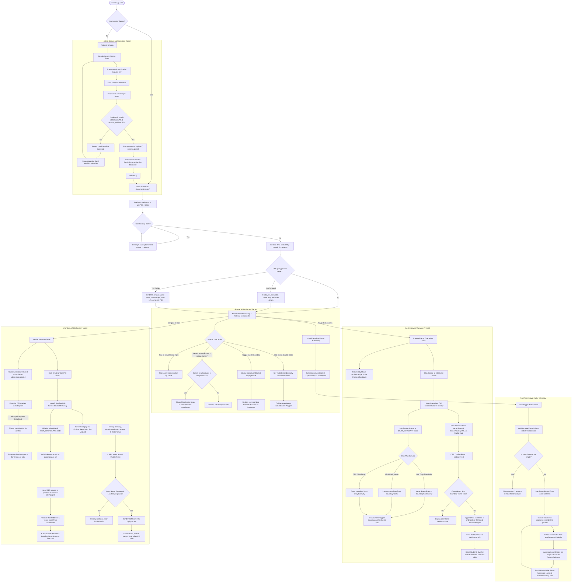

# Activity Diagrams

This section provides comprehensive, dynamic workflows and state transitions for both the **Lattice Mobile Application** and the **Lattice Administration Web Platform (Web-Admin)**, derived directly from the source code.

---

## 📱 Mobile App Workflows

This diagram comprehensively describes the dynamic workflows and real state transitions of the **Lattice Mobile Application**, derived directly from the TypeScript source code. It models the launch sequence, dual-canvas sliding dashboard transitions, snap search island behavior, route planning, active navigation, and the adaptive AR viewfinder HUD.

```mermaid
flowchart TD
    %% 1. Startup & Prep
    Start(["App Opened"]) --> NavigationReady{"Navigation State Ready?"}
    NavigationReady -- No --> WaitNav["Wait for navigationState.key"] --> NavigationReady
    NavigationReady -- Yes --> Prefetch["Launch Data Pre-fetch: events-search & POIs"]
    Prefetch --> TimeoutCheck{"Pre-fetch complete\nor 5s Safety Timeout?"}
    TimeoutCheck -- Yes --> SetDataReady["Set isDataReady = true"]
    SetDataReady --> CheckAuth{"Session Token or\nGuest Mode active?"}

    %% 2. Auth & Onboarding Branching
    CheckAuth -- Yes --> GoToMain["replace /(main)"]
    CheckAuth -- No --> GoToOnboarding["replace /(auth)/onboarding"]

    %% Onboarding Flow
    subgraph Onboarding ["Onboarding Screen"]
        GoToOnboarding --> ViewSlides["View Slides 1-3 with motion interpolations"]
        ViewSlides --> ActionSelect{"User Action"}
        ActionSelect -- "Continue as Guest" --> SetGuest["setGuestMode_true & setLastScreenMode_0"]
        SetGuest --> GoToMain
        ActionSelect -- "Get Started" --> GoToLogin["push /(auth)/login"]
    end

    subgraph Authentication ["Authentication Screen"]
        GoToLogin --> LoginSelect{"Auth Mode"}
        LoginSelect -- "Social Auth" --> GoogleApple["Google / Apple SSO"]
        LoginSelect -- "Email Login" --> EmailScreen["Email Credentials"]
        GoogleApple --> VerifySuccess{"Verify Success?"}
        EmailScreen --> VerifySuccess
        VerifySuccess -- Yes --> ClearGuest["setGuestMode_false"] --> GoToMain
        VerifySuccess -- No --> LoginError["Show Alert Error"] --> LoginSelect
    end

    %% 3. Main Dashboard Layout
    subgraph MainDashboard ["Main Canvas Dashboard"]
        GoToMain --> CheckScreenMode{"screenMode.value"}
        
        %% Explore Mode
        CheckScreenMode -- "0 (Explore)" --> RendersExplore["Renders DiscoveryFeed"]
        RendersExplore --> ClickFeedItem["Click Event/POI Item"]
        ClickFeedItem --> SwitchToMap["Auto-switch screenMode.value to 1"]
        
        %% Map Mode
        CheckScreenMode -- "1 (Map)" --> RendersMap["Renders MapContent via MapLibreGL"]
        SwitchToMap --> RendersMap
        
        %% Mode Toggle Action
        RendersMap --> DragToggle["Drag/Press Bottom-Left Mode Pill"]
        DragToggle --> SwitchToExplore["Switch screenMode.value to 0"]
        SwitchToExplore --> RendersExplore
    end

    %% 4. Top Search Island & Drawer Gestures
    subgraph SearchIsland ["Top Search Island Drawer"]
        RendersMap --> DetectPan["Detect Gesture.Pan on Search Island"]
        DetectPan --> SnapLevels{"Evaluate Drag Snaps"}
        
        SnapLevels -- "Level 1 (islandState = 0.0)" --> CollapsedSearch["Collapsed Search Bar + Profile Button"]
        SnapLevels -- "Level 2 (islandState = 0.5)" --> DashboardSearch["Renders DiscoveryDashboard: categories & recommended POIs"]
        SnapLevels -- "Level 3 (islandState = 1.0)" --> FullSearch["Renders SearchExperience: query typing & search history"]
        
        %% Anti-Skip Protection
        DetectPan -.-> AntiSkip["Anti-Skip Constraint: Forces user to drag through 0.5 first"]
        
        %% Profile sheet accessibility trigger
        CollapsedSearch --> ClickProfile["Press Profile Button"]
        ClickProfile --> ProfileSheet["Slide-out ProfileSheet"]
        ProfileSheet --> AccessibilityToggles["Configure Toggles: Avoid Stairs / Avoid Crowds / Wheelchair Mode"]
    end

    %% 5. Event Detail & Route Planning Sheets
    subgraph RoutePlanning ["Route Selection & Planning"]
        RendersMap --> TapMapMarker["Tap Event/POI Marker"]
        TapMapMarker --> OpenDetail["Open EventDetailSheet / POI Drawer"]
        OpenDetail --> ClickDirections["Click Get Directions"]
        
        ClickDirections --> PlanningMode["Transition UIState to MapUIState.PLANNING"]
        PlanningMode --> OpenPlanning["Open RoutePlanningSheet"]
        OpenPlanning --> FetchRoutes["Concurrent Route Fetch: driving, walking & bicycle"]
        FetchRoutes --> DisplayRouteVariants["Render route path options & ETAs"]
        DisplayRouteVariants --> SelectTransport["Change Transport Mode Profile"]
    end

    %% 6. Active Navigation Flow
    subgraph ActiveNavigation ["Active Guidance Mode"]
        DisplayRouteVariants --> ClickStartNav["Click Start Navigation"]
        ClickStartNav --> StartNavStore["trigger startNavigation store action"]
        
        StartNavStore --> UpdateNavState["isPlanning = false, isNavigating = true"]
        UpdateNavState --> SetUINav["setUIState to MapUIState.NAVIGATING"]
        SetUINav --> CollapseIsland["Collapse Top Search Island to 0.0"]
        CollapseIsland --> ClearSelections["Clear selectedPoi & selectedEvent to prevent occlusion"]
        
        ClearSelections --> NavigationHUDs["Render Active Navigation HUDs"]
        NavigationHUDs --> InstructionBanner["Render InstructionBanner: turn instructions"]
        NavigationHUDs --> NavigationInfo["Render NavigationInfo: distance, duration & destination name"]
        
        %% Navigation Controls
        NavigationHUDs --> NavActions{"User Actions"}
        NavActions -- "Press Recenter" --> TriggerRecenter["Trigger Recenter Count: Snap camera to passive follow"]
        NavActions -- "Press Stop Navigation" --> StopNav["stopNavigation: Returns user to PLANNING state"]
        NavActions -- "Press Close Route" --> ClearNav["clearNavigation: Exits to EXPLORING base map"]
    end

    %% 7. Augmented Reality HUD Overlay
    subgraph ARHud ["Adaptive AR Navigation HUD"]
        NavigationHUDs --> WatchMotion["Poll DeviceMotionbeta/gamma at 60fps"]
        WatchMotion --> CheckTilt{"Phone beta tilt in range 45 - 135 degrees?"}
        
        CheckTilt -- No (Flat) --> KeepHidden["Keep AR Overlay hidden / Renders standard map"]
        CheckTilt -- Yes (Upright) --> LaunchAROverlay["Launch AROverlay"]
        
        LaunchAROverlay --> LockPortrait["Lock screen orientation to strict Portrait Up"]
        LockPortrait --> StartCam["Start Expo CameraView background feed"]
        StartCam --> CanvasScene["Load MainARScene on background Canvas"]
        
        CanvasScene --> OverlayLabels["Project 2D screen overlay labels based on bearing"]
        OverlayLabels --> HeadingCompass["Track trueHeading compass to calculate bearing offset"]
        HeadingCompass --> AngleCheck{"Angle diff is within [-35, 35] horizontal FOV?"}
        
        AngleCheck -- Yes --> DrawBubble["Render high-contrast projected label bubble"]
        AngleCheck -- No --> CheckSingleTarget{"Is tracking single navigation target?"}
        
        CheckSingleTarget -- No --> HideBubble["Hide label bubble"]
        CheckSingleTarget -- Yes --> ClampBubble["Clamp bubble to screen edge"]
        ClampBubble --> RenderGuideArrows["Render offscreen guide arrows: « Left or Right »"]
        
        DrawBubble --> DepthScaling["Scale label down logarithmically based on GPS distance"]
    end
```

### Functional Breakdown of Mobile App Workflows

1. **Strict Startup Lifecycle Synchronization**:
   * `app/index.tsx` verifies `navigationState?.key` first to prevent runtime crashes before the Expo Router is fully mounted.
   * Initiates asynchronous data pre-fetching (events and POIs) with a **5-second** safety timeout to guarantee a smooth user experience even under poor network conditions.

2. **Interactive Sliding Welcome Screen (Onboarding)**:
   * Integrated with smooth motion interpolations to enhance feedback and guide new users intuitively.
   * Binary flow: Full authentication supporting SSO and email credentials, or guest access bypassing authentication.

3. **Dynamic Dual Canvas Dashboard (Explore vs Map)**:
   * Coordinated in `app/(main)/index.tsx` via a horizontally sliding viewport controlled by React Native Reanimated's `screenMode.value`.
   * Smart transition hooks: Tapping any item in the discovery feed automatically shifts the canvas to Map mode and zooms to focus the selected element.

4. **Triple-Height Expansive Top Search Drawer (Search Island)**:
   * Floating panel snapping across three predefined height states based on finger gestures (`Gesture.Pan`): collapsed (`0.0`), intermediate dashboard (`0.5`), and full search query view (`1.0`).
   * Implements an anti-skip swipe constraint to ensure the drawer flows naturally through state transitions.

5. **Concurrent Multi-Profile Route Planning**:
   * During the planning phase, the client fetches optimal routes for driving, walking, and bicycling in parallel.
   * Automatically adapts calculated routes in real-time according to accessibility parameters selected in the user's profile (e.g., avoiding staircases).

6. **Active Turn-by-Turn Guidance State**:
   * Transitioning into navigation mode instantly isolates the interface: clears non-target markers from the map and displays active turn instructions on a high-contrast HUD banner.

7. **Adaptive Hardware-Triggered AR Navigation HUD**:
   * Smart activation via device motion: launches automatically only when the phone is held vertically (gyroscope angular tilt between 45° and 135°).
   * Projects 2D screen overlays tracking true compass headings, showing guide arrows at the screen edges if the active navigation target is outside the camera's horizontal FOV.

---

## 💻 Web-Admin Workflows

This diagram comprehensively describes the operational workflows of the **Lattice Administration Web Platform (Web-Admin)**. It graphically represents the initialization of the global command center dashboard, search filtration behavior, real-time map synchronization via WebSockets, real-time location telemetry processing (Crowd Radar), and the geographical creation/edition lifecycle of events and points of interest (POIs) extracted directly from the Next.js codebase.

### Functional Breakdown of Web-Admin Workflows

1. **Security and Administrative Access (Access Control & `/login`)**:
   * **Middleware Gatekeeper**: The system utilizes a Next.js middleware check; if no active encrypted session cookie (`session`) is detected, the user is instantly redirected to the secure login page (`/login`).
   * **Secure Server Actions**: The credential form leverages React's `useActionState` hook bound to the `'use server'` function `login`. This function executes exclusively on the server side to validate the operational email and security key against the secret backend variables `ADMIN_EMAIL` and `ADMIN_PASSWORD`.
   * **Session Encryption & Cookies**: Upon successful validation, the server encrypts the user email and expiration timestamp (set to **24 hours**), writes the encrypted cookie (`session`) with high-security parameters (`httpOnly`, `sameSite=lax`), and redirects the administrator to the main command center `/`.

2. **Global Command Center (Command Center - `/`)**:
   * **Coordinated Loading**: The `useEvents()` and `usePOIs()` hooks efficiently manage synchronous data loading, displaying a global center spinner page until data is successfully integrated.
   * **URL Parameter Synchronization**: Opening the portal with `poiId` or `eventId` query parameters initiates automatic focusing: makes the parent event visible, zooms the camera to level 18, and renders the metadata slide-out panel in the sidebar drawer.

3. **Search Filtration & Solo Mode Isolation**:
   * **Unique Match Snap**: While filtering the event list in the sidebar, if the query matches exactly 1 unique event, the map camera automatically snaps to focus on that event.
   * **Solo Mode Zooming**: Double-clicking an event isolates its bounds, hiding all other event layers and calling `fitBounds` to seamlessly frame the geographical perimeter of the selected event's polygon.

4. **Real-Time Crowd Radar Telemetry Polling**:
   * **Dynamic Intervals**: Toggling the radar on active events initializes a background fetch routine executing **every 5 seconds**.
   * **Aggregated Density Heatmaps**: Collects live GPS coordinates from the `/api/geo/locations?eventId=ID` endpoint, parses them into a unified GeoJSON `FeatureCollection`, and passes it directly to the Mapbox/MapLibre source to render real-time Heatmap Tiles.

5. **Event Perimeter Creation & Lifecycle**:
   * **Interactive Drawing Overlay (`DRAW_BOUNDARY`)**: Creating an event launches a full-screen map overlay allowing point-by-point path definition. Floating tool buttons offer `Undo` and `Clear` state operations.
   * **Polygon Ring Closing**: Upon form confirmation, the client automatically closes the polygon ring by closing the coordinate array and serializing standard GeoJSON structures.

6. **Amenity Registration & reverse-geocoding (`/pois`)**:
   * **Reverse Geocoding Coordinates**: Placing custom pins in `PICK_COORDINATE` mode fires a fetch query to `/api/resolve-address?lat=Y&lng=X` to resolve human-readable postal addresses and venue titles, auto-populating the UI inputs.
   * **WebSocket Multi-Client Sync**: Subscribes the browser client to the `'admin:pois:updated'` topic using WebSockets. When occupancy changes are made elsewhere, it triggers a non-blocking list refresh, maintaining real-time occupancy bar graphs.
