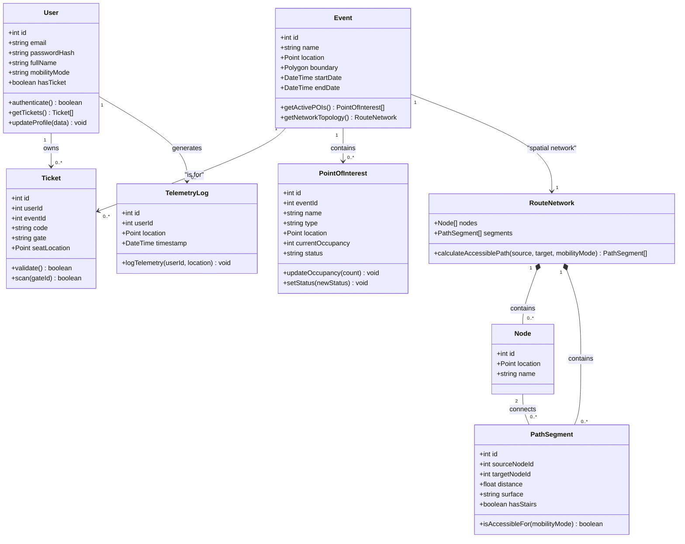

# Class Diagram

This diagram represents the core object-oriented class structure of the **Lattice** domain model, showing the attributes, operations, and relationships between the primary entities.

## Domain Model Class Diagram

## Architectural Insights

1.  **Strict Type Safety**: These classes map directly to the TypeScript schemas defined in `@app/types-schema` and Drizzle ORM models in `@app/db`.
2.  **Geospatial Integration**: Geometric attributes like `Point` and `Polygon` leverage PostGIS database extensions, translated into standard GeoJSON structures for consumption by the MapLibre mobile rendering engine.
3.  **Domain Decoupling**: Services interact strictly via domain boundaries (e.g., the `RouteNetwork` encapsulates the complexity of the A* / Dijkstra pathfinding routing away from the core `Event` service).

