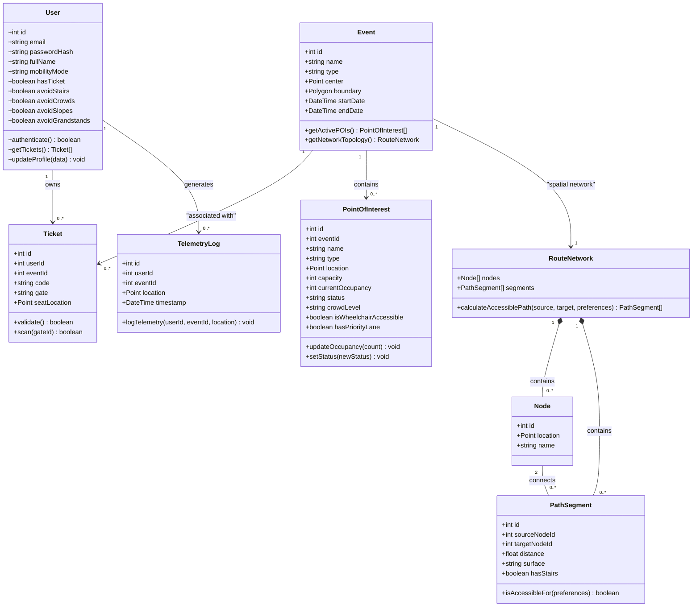

import { Callout } from 'nextra/components'

# Class Diagram

This document models the primary object-oriented domain classes governing the **Lattice** monolith. It details attributes, operations, and architectural relationships, representing the core entities processed by the system.

---

## Domain Model Class Diagram

---

## Architectural Patterns and Structural Details

### 1. Unified Typings
These classes do not exist in isolation; they are tied directly to compile-time TypeScript declarations in `@app/types-schema` and database schema tables in `@app/db`. This structural alignment guarantees type safety across the entire stack.

### 2. Service Layer Decoupling
Business logic is isolated away from transport controllers (Express routers).
*   **Controller Layer**: Handles raw request validation, parses route parameters, manages session caching, and handles CORS/rate-limiting constraints.
*   **Service Layer**: Expressed as domain service classes (such as `PoiService` or `EventService`). Services are responsible for orchestration, database querying, validation, cache eviction, and dispatching events via WebSockets.

### 3. Spatial Aggregation Pattern
Geospatial entities (`Point` and `Polygon`) leverage WGS 84 geometries.
*   **Database Level**: PostGIS manages precise coordinates and spatial operations.
*   **API Level**: Coordinates are automatically serialized into GeoJSON standard structures (`Point` / `Polygon`), facilitating direct rendering on the MapLibre mobile canvas or Next.js map dashboards.

<Callout type="info">
  **Domain Decoupling**: The `RouteNetwork` class encapsulates all routing calculations (such as Dijkstra or A* pathfinding graphs), isolating the core `Event` service from the complexities of navigation logic.
</Callout>
