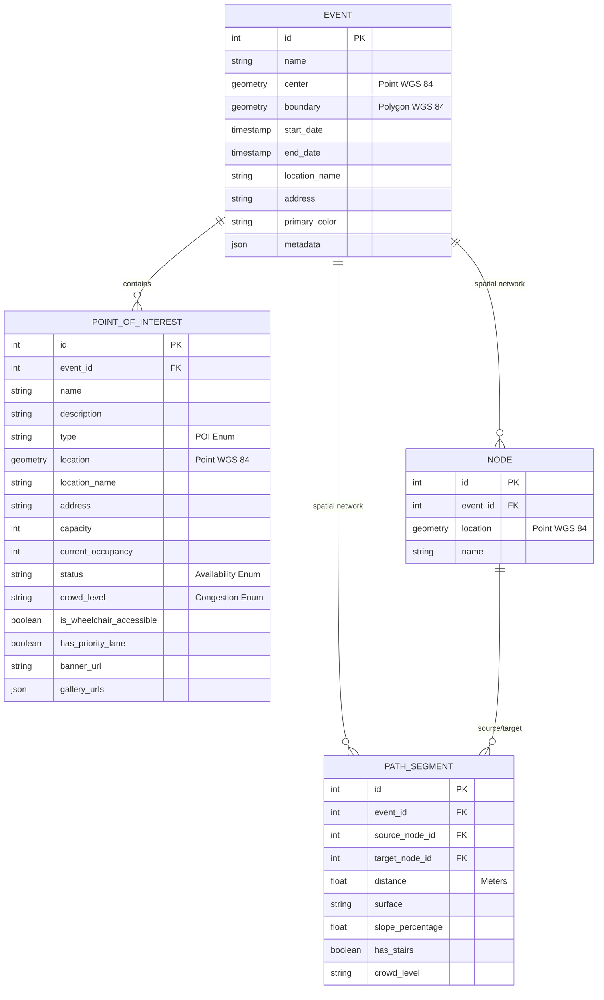
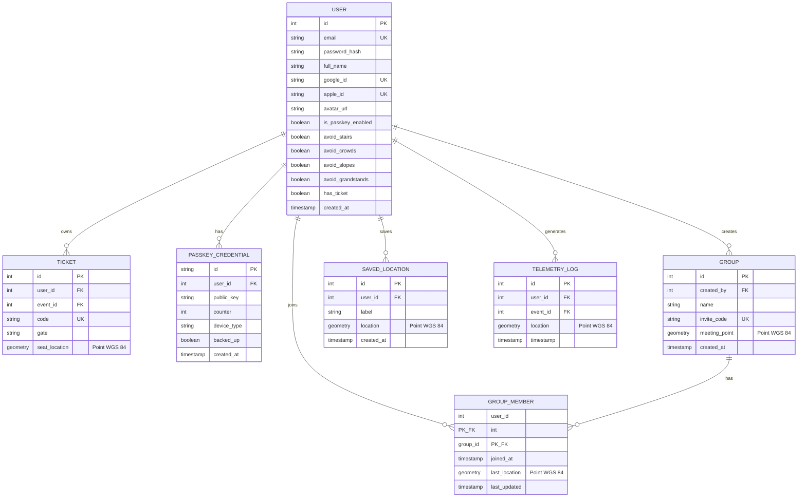

import { Callout } from 'nextra/components'

# Database Schema

Lattice utilizes a relational **PostgreSQL** database supercharged with the **PostGIS** extension to execute high-performance, real-time spatial calculations. Database connections, table layouts, and schemas are orchestrated through **Drizzle ORM** inside the shared package `@app/db`.

To clarify the relational dependencies, the database layout is divided into two distinct operational schemas: **Core Operations & Geospatial Network** and **User Identity & Telemetry Support**.

---

## 1. Core Operations and Geospatial Network

This schema houses the core physical resources of our events. It defines event boundaries, localized Points of Interest (POIs) such as gates and medical services, and the geospatial network (nodes and segments) designed to calculate optimal pedestrian navigation routes on the client side.



### Table Specifications: Core & Geospatial

#### EVENT Table
Defines the main perimeter, operational parameters, and visual settings for an active event.

| Column | Type | Constraints | Description |
| :--- | :--- | :--- | :--- |
| `id` | `serial` | Primary Key | Unique autoincrementing index. |
| `name` | `varchar(255)` | Not Null | Official public name of the event. |
| `type` | `varchar(50)` | Not Null | Event type (e.g., `music`, `food`, `tech`). |
| `center` | `geometry(Point, 4326)` | Spatial Index | Central coordinate utilized to anchor map viewports. |
| `boundary` | `geometry(Polygon, 4326)`| Spatial Index | Polygonal boundary of the event perimeter. |
| `start_date` | `timestamp` | Not Null | Opening time of the event. |
| `end_date` | `timestamp` | Not Null | Closing time of the event. |
| `location_name` | `varchar(255)` | Nullable | Common venue name. |
| `address` | `text` | Nullable | Street address of the venue. |
| `primary_color` | `varchar(7)` | Nullable | Visual brand color for client custom styling. |
| `metadata` | `jsonb` | Nullable | Flexible settings or metrics. |

#### POINT_OF_INTEREST (POI) Table
Tracks localized services, facilities, and live capacities inside or adjacent to active events.

| Column | Type | Constraints | Description |
| :--- | :--- | :--- | :--- |
| `id` | `serial` | Primary Key | Unique autoincrementing index. |
| `event_id` | `integer` | Foreign Key (EVENT) | Parent event container. |
| `name` | `varchar(255)` | Not Null | Descriptive title of the facility. |
| `description` | `text` | Nullable | Operational notes about the POI. |
| `type` | `varchar(50)` | Not Null | POI class (e.g., `medical`, `wc`, `restaurant`). |
| `location` | `geometry(Point, 4326)` | Spatial Index | Exact point coordinate structured as `[lng, lat]`. |
| `location_name` | `varchar(255)` | Nullable | Localized location description. |
| `address` | `text` | Nullable | Street address. |
| `capacity` | `integer` | Nullable | Maximum occupancy threshold. |
| `current_occupancy` | `integer` | Default `0` | Live active visitor count. |
| `status` | `varchar(50)` | Default `open` | Availability: `open`, `closed`, `maintenance`. |
| `crowd_level` | `varchar(50)` | Default `low` | Crowd density: `low`, `moderate`, `high`, `blocked`. |
| `is_wheelchair_accessible`| `boolean`| Default `false` | Complete wheelchair/stroller accessibility flag. |
| `has_priority_lane` | `boolean` | Default `false` | Preferential queue flag. |

---

## 2. User Identity, Access, and Telemetry Support

This schema manages user authentication, biometric passkey credentials, group real-time location sharing, digital ticket claims, and historical telemetry logging used to feed crowd radar aggregates.



### Table Specifications: Identity & Telemetry

#### USER Table
Stores core identities, credentials, and custom navigation accessibility preferences.

| Column | Type | Constraints | Description |
| :--- | :--- | :--- | :--- |
| `id` | `serial` | Primary Key | Unique autoincrementing index. |
| `email` | `varchar(255)` | Unique, Not Null | User primary contact and local credential key. |
| `password_hash` | `varchar(255)` | Nullable | Encrypted credential string (Bcrypt). Null for social login. |
| `full_name` | `varchar(255)` | Nullable | Visual profile name. |
| `google_id` | `varchar(255)` | Unique, Nullable | Google OAuth identifier. |
| `apple_id` | `varchar(255)` | Unique, Nullable | Apple OAuth identifier. |
| `is_passkey_enabled` | `boolean` | Default `false` | Biometric passkey flag. |
| `avoid_stairs` | `boolean` | Default `false` | Navigation preference: avoid staircases. |
| `avoid_crowds` | `boolean` | Default `false` | Navigation preference: bypass congested pathways. |
| `avoid_slopes` | `boolean` | Default `false` | Navigation preference: avoid steep terrain. |
| `avoid_grandstands` | `boolean` | Default `false` | Navigation preference: bypass grandstand climbs. |
| `has_ticket` | `boolean` | Default `false` | Active claimed ticket flag. |

#### TELEMETRY_LOG Table
Maintains historical, high-frequency GPS logs reported by mobile clients.

| Column | Type | Constraints | Description |
| :--- | :--- | :--- | :--- |
| `id` | `serial` | Primary Key | Unique autoincrementing index. |
| `user_id` | `integer` | Foreign Key (USER) | Reporting user. Null for anonymous pings. |
| `event_id` | `integer` | Foreign Key (EVENT) | Associated event boundary. |
| `location` | `geometry(Point, 4326)` | Spatial Index | Exact coordinates structured as `[lng, lat]`. |
| `timestamp` | `timestamp` | Default `now()` | Exact logging time. |

---

## Architectural and Database Decisions

### 1. Spatial Native Data (WGS 84 WKT / EWKB)
All geographical geometries are stored using WGS 84 (SRID 4326) projections. This allows PostgreSQL to run fast native geometric operations via PostGIS extensions rather than manually processing coordinates in Node:

```sql
-- Find if a POI coordinate falls inside an Event's boundary polygon
SELECT poi.name, ST_Contains(event.boundary, poi.location) AS is_inside
FROM point_of_interest poi
JOIN event event ON poi.event_id = event.id
WHERE poi.id = 12;
```

### 2. Spatial Indexing via GIST
Standard indices are inefficient for multidimensional coordinates. Lattice implements **GIST (Generalized Search Tree)** indexes on all geospatial columns (`EVENT.boundary`, `POINT_OF_INTEREST.location`, `TELEMETRY_LOG.location`). This accelerates perimetral boundary matching and proximity searches from seconds to microseconds.

### 3. Isolation of Analytics (Telemetry Logs)
High-frequency GPS pings from mobile users generate substantial database write traffic. To prevent locking standard transactions (such as user profile edits or ticket claims), telemetry is routed to the dedicated `telemetry_log` table. Live heatmap aggregations query this isolated log using narrow, 2-minute time constraints to minimize system load:

```sql
-- Query heatmap coordinates for MapLibre Layer (Last 2 minutes)
SELECT id, location 
FROM telemetry_log 
WHERE event_id = 1 AND timestamp >= NOW() - INTERVAL '2 minutes';
```

<Callout type="warning">
  **Migration Integrity**: Do not write raw SQL mutations directly in the PostgreSQL CLI. All schema modifications must be declared inside the `@app/db` schema folder and generated as Drizzle migrations to ensure target safety across development and production environments.
</Callout>
