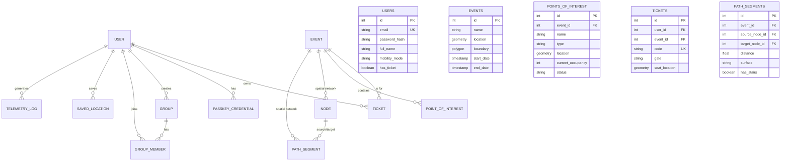

# Database Schema

Lattice uses a relational PostgreSQL database with **PostGIS** for high-performance geospatial operations. The schema is managed via **Drizzle ORM**.

## Entity Relationship Diagram

## Key Architectural Decisions

1.  **Geospatial Native**: We use the `geometry` type for all coordinates, allowing us to perform complex spatial joins and proximity searches directly in SQL.
2.  **Modular Monolith Integration**: All domain tables share a unified schema, ensuring cross-domain relational integrity (e.g., ensuring a ticket can only be created for an existing event).
3.  **Audit & Telemetry**: The `telemetry_logs` table allows for historical crowd density analysis without impacting the performance of the core operational tables.
