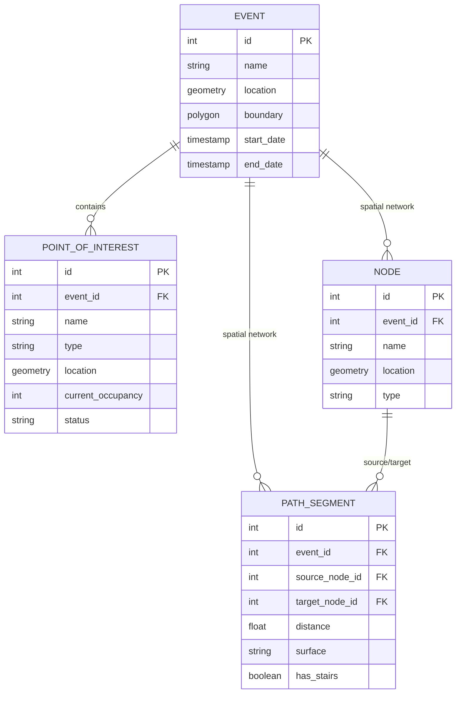
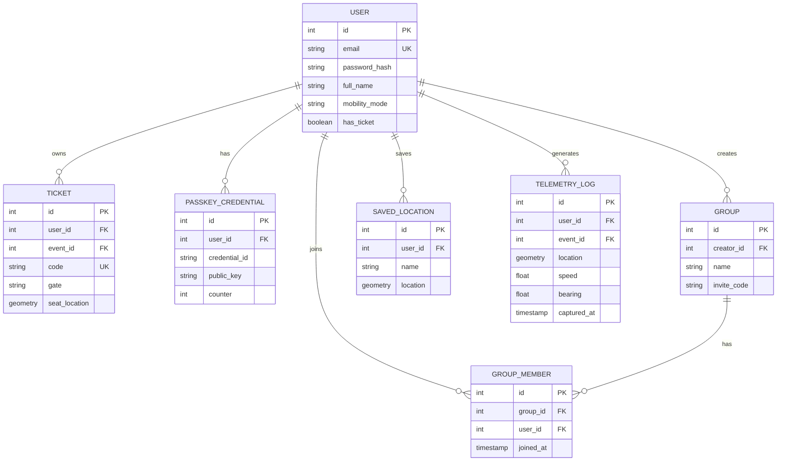

import { useState, useRef, useEffect } from 'react'

export const ZoomableMermaid = ({ children }) => {
  const containerRef = useRef(null);
  const [scale, setScale] = useState(0.85);
  const [position, setPosition] = useState({ x: 0, y: 0 });
  const [isDragging, setIsDragging] = useState(false);
  const [dragStart, setDragStart] = useState({ x: 0, y: 0 });
  const [isFullscreen, setIsFullscreen] = useState(false);

  const handleWheel = (e) => {
    e.preventDefault();
    const zoomFactor = 0.08;
    const direction = e.deltaY < 0 ? 1 : -1;
    const newScale = Math.min(Math.max(scale + direction * zoomFactor, 0.2), 4);
    setScale(newScale);
  };

  const handleMouseDown = (e) => {
    if (e.button !== 0) return;
    setIsDragging(true);
    setDragStart({ x: e.clientX - position.x, y: e.clientY - position.y });
  };

  const handleMouseMove = (e) => {
    if (!isDragging) return;
    setPosition({
      x: e.clientX - dragStart.x,
      y: e.clientY - dragStart.y
    });
  };

  const handleMouseUp = () => {
    setIsDragging(false);
  };

  useEffect(() => {
    const el = containerRef.current;
    if (!el) return;
    const preventScroll = (e) => {
      e.preventDefault();
    };
    el.addEventListener('wheel', preventScroll, { passive: false });
    return () => el.removeEventListener('wheel', preventScroll);
  }, []);

  return (
    

      

        <button 
          type="button"
          onClick={() => setScale(prev => Math.min(prev + 0.15, 4))}
          style={{
            background: 'none',
            border: 'none',
            color: '#fff',
            fontSize: '18px',
            cursor: 'pointer',
            padding: '4px 10px',
            borderRadius: '6px',
            transition: 'background 0.2s',
          }}
        >+</button>
        <button 
          type="button"
          onClick={() => setScale(prev => Math.max(prev - 0.15, 0.2))}
          style={{
            background: 'none',
            border: 'none',
            color: '#fff',
            fontSize: '18px',
            cursor: 'pointer',
            padding: '4px 12px',
            borderRadius: '6px',
            transition: 'background 0.2s',
          }}
        >-</button>
        
          {Math.round(scale * 100)}%
        
        <button 
          type="button"
          onClick={() => { setScale(0.85); setPosition({ x: 0, y: 0 }); }}
          style={{
            background: 'none',
            border: 'none',
            color: '#fff',
            fontSize: '11px',
            fontWeight: '600',
            textTransform: 'uppercase',
            cursor: 'pointer',
            padding: '6px 10px',
            borderRadius: '6px',
            transition: 'background 0.2s',
          }}
        >Reset</button>
        <button 
          type="button"
          onClick={() => setIsFullscreen(!isFullscreen)}
          style={{
            background: 'none',
            border: 'none',
            color: '#fff',
            fontSize: '11px',
            fontWeight: '600',
            textTransform: 'uppercase',
            cursor: 'pointer',
            padding: '6px 10px',
            borderRadius: '6px',
            transition: 'background 0.2s',
          }}
        >
          {isFullscreen ? 'Exit' : 'Full Screen'}
        </button>
      

      

        💡 Scroll over diagram to Zoom | Left-click + Drag to Pan
      

      

        

          {children}
        

      

    

  )
}

# Database Schema

Lattice uses a relational PostgreSQL database with **PostGIS** for high-performance geospatial operations. The schema is managed via **Drizzle ORM**.

To make the database architecture easier to digest and read, we have divided the relational layout into two separate focused schemas: the **Core operations & Geospatial Network** and **User Identity & Telemetry Support**.

---

## 1. Core Operations & Geospatial Network Schema

This schema models the core physical infrastructure of an event. It defines the event boundaries, the localized Points of Interest (POIs) like food and restrooms, and the spatial routing node network used to calculate optimal pedestrian navigation routes.

<ZoomableMermaid>

</ZoomableMermaid>

---

## 2. User Identity, Access, & Telemetry Support Schema

This schema governs authentication, passkey credentials, group location sharing, active ticket registers, and historical telemetry logging used by the crowd radar to analyze real-time density.

<ZoomableMermaid>

</ZoomableMermaid>

---

## Key Architectural Decisions

1.  **Geospatial Native**: We use the `geometry` type for all coordinates, allowing us to perform complex spatial joins and proximity searches directly in SQL via PostGIS.
2.  **Routing Nodes & Path Segments**: All walking networks are parsed as segments connected by coordinates nodes, enabling the client to execute Dijkstra-like routing calculations constrained by stair and accessibility flags.
3.  **Audit & Telemetry**: The `telemetry_logs` table stores high-frequency location ping data from mobile clients. This isolates active database transactions from analytics processing, ensuring the crowd density radar performs flawlessly.
