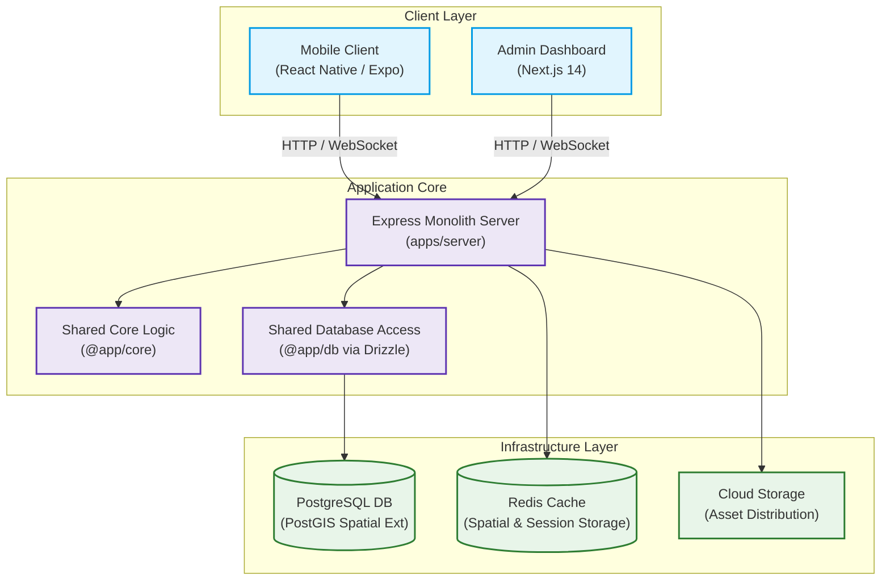

import { Callout } from 'nextra/components'

# System Overview

Welcome to the **Lattice** architecture reference. This section provides an in-depth view of the system's structural blueprint, monorepo hierarchy, database patterns, and domain services. Lattice is engineered as a highly performant, location-aware platform designed to deliver real-time event discovery and pedestrian navigation within curated urban environments.

---

## Architectural Philosophy

Lattice is built upon three core design priorities:
1. **Type Consistency**: Eliminating the risk of API type drift across web, mobile, and backend nodes.
2. **Geospatial Integrity**: Utilizing native, high-performance spatial queries with strict verification layers.
3. **Scalable Modularization**: Structuring the backend as a modular monolith with decoupled service boundaries.

---

## High-Level Architecture

The platform is organized as a Turborepo monorepo utilizing pnpm workspaces. This model consolidates multiple application runtimes alongside shareable packages, simplifying dependency management and optimizing compile pipelines.

---

## Key Core Components

### 1. Mobile Client (`apps/mobile`)
The primary interface for event attendees.
*   **Engine**: React Native and Expo.
*   **Geospatial Layer**: MapLibre GL for client-side vector map rendering.
*   **Features**: Location-aware discovery feeds, real-time spatial navigation, off-screen target guidance, and gyro-responsive Augmented Reality viewfinders.

### 2. Admin Dashboard (`apps/admin-web`)
The command center for administrators, editors, and security staff.
*   **Engine**: Next.js 14 utilizing Server Actions and React Server Components.
*   **Features**: Perimetral boundary drawing overlays, Point of Interest (POI) curation, reverse-geocoding resolution, and live crowd telemetry heatmap overlays.

### 3. API Monolith Server (`apps/server`)
The centralized runtime that governs business operations.
*   **Engine**: Node.js and Express.
*   **Pattern**: Service Layer pattern. Controllers handle HTTP validation and serialization, then delegate operations to domain-specific Services (`PoiService`, `EventService`, `RoutingService`).

### 4. Shared Packages (`packages/*`)
Internal libraries imported directly by the applications:
*   `db`: Declares the database schemas and manages migrations via Drizzle ORM.
*   `types-schema`: Consolidates universal TypeScript types, inferred directly from database structures and request/response specifications.
*   `core`: Provides reusable middlewares, logger utilities, and general configurations.

---

## Domain Boundaries

The application logic is decoupled into distinct domain boundaries:

*   **Geospatial (Geo)**: Governs spatial indexing, POI status updates, perimetral polygon evaluations, and forward/reverse address resolution.
*   **Identity & Access (Auth)**: Handles credential cryptography (Bcrypt), secure JWT lifecycle management, and WebAuthn Passkey registration/login phases.
*   **Pedestrian Navigation (Nav)**: Responsible for topological routing calculations, accessibility segment filtering, and Valhalla routing proxies.
*   **Crowd Telemetry (Telemetry)**: Manages fast database insertions for device GPS coordinates and aggregates coordinate points into dynamic heatmap FeatureCollections.

<Callout type="info">
  This monorepo layout enables developers to compile, test, and package all elements in a single step using the Turborepo engine, guaranteeing total type-safety from database columns directly to mobile UI screens.
</Callout>
