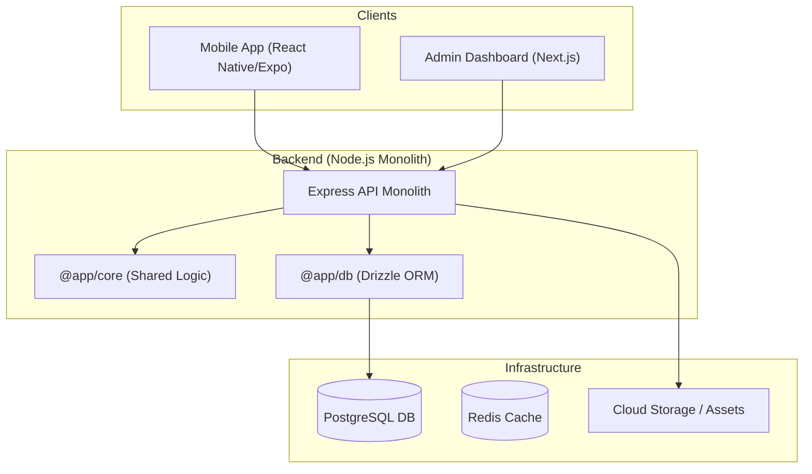

# System Overview

Welcome to the **Lattice** architecture overview. This document describes the high-level structure of our monorepo and how the different components interact to provide the best event and festival discovery experience in Barcelona.

## Project Vision

Lattice is designed to be the definitive guide for urban discovery. Our primary goal is to connect clients with the vibrant cultural scene of Barcelona, providing real-time information about festivals, events, and Points of Interest (POIs) through a highly performant and accessible interface.

## High-Level Architecture

The project is structured as a **Turborepo monorepo**, ensuring maximum code reuse and consistency across our web, mobile, and backend services.

### Core Components

1.  **Mobile App (`apps/mobile`)**: The primary interface for end-users. Built with React Native and Expo, featuring MapLibre for high-performance mapping.
2.  **Admin Web (`apps/admin-web`)**: A high-density dashboard for administrators to curate content and monitor system health.
3.  **API Monolith (`apps/server`)**: A centralized service layer that handles business logic. It is divided into internal domains (Geo, Auth, Social).
4.  **Shared Packages (`packages/*`)**:
    *   `db`: Single source of truth for the database schema and migrations using Drizzle ORM.
    *   `types-schema`: Shared TypeScript interfaces ensuring type safety from the DB to the Mobile UI.
    *   `core`: Common utilities, logging, and middleware.

## Service Domains

-   **Geospatial (Geo)**: Handles spatial searches, POI management, and custom routing logic.
-   **Identity (Auth)**: Manages user profiles and handles secure JWT-based authentication with bcrypt hashing.
-   **Social**: Orchestrates group discovery and real-time interaction between users.

## Tech Stack

-   **Languages**: TypeScript (Strict mode enabled).
-   **Frontend**: Next.js 14, React, Vanilla CSS (CSS Modules).
-   **Mobile**: React Native, Expo, MapLibre GL.
-   **Backend**: Node.js, Express, Drizzle ORM.
-   **Database**: PostgreSQL (with PostGIS for geospatial queries).
-   **Identity**: Custom JWT Authentication.
-   **Tooling**: pnpm, Turborepo, Docker.
