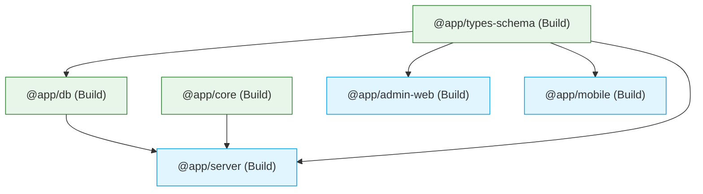

import { Callout } from 'nextra/components'

# Monorepo Structure

Lattice leverages a high-performance **pnpm monorepo** managed by **Turborepo**. This structure consolidates all applications and internal libraries into a single version-controlled repository, streamlining code reuse, enforcing configuration uniformity, and eliminating type drift.

---

## Directory Layout

The codebase is organized into deployable runtimes (`apps/`) and reusable internal dependencies (`packages/`):

```text
.
├── apps/                    # Deployable Applications
│   ├── admin-web/           # Next.js 14 Admin Command Center
│   ├── mobile/              # React Native / Expo Mobile Client
│   └── server/              # Express API Monolith Server
├── packages/                # Internal Shared Libraries
│   ├── core/                # Logger configurations and shared middleware
│   ├── db/                  # Drizzle ORM Schema, connections, and migrations
│   ├── theme/               # Centralized Design Tokens (colors, spacing, typography)
│   └── types-schema/        # Universal TypeScript typings and API contracts
├── docs/                    # Centralized Documentation (Nextra Site)
├── package.json             # Root Workspace declarations
├── pnpm-workspace.yaml      # Monorepo Workspace routing
└── turbo.json               # Turborepo build pipeline orchestration
```

---

## Workspace Architecture

By utilizing `pnpm workspaces`, applications can declare dependencies on local packages exactly as they would for public npm packages. The symlinking is handled automatically by the pnpm package manager.

For example, the Express Server (`apps/server/package.json`) references the shared database package:

```json
{
  "name": "@app/server",
  "dependencies": {
    "@app/db": "workspace:*"
  }
}
```

---

## Shared Package Roles

Shared packages form the foundation of our engineering consistency. They ensure that internal business contracts are enforced across all runtime targets.

### 1. Database Access (`@app/db`)
The Single Source of Truth (SSOT) for the platform's relational data model.
*   **Purpose**: Exports database connection pooling, table schemas, and queries.
*   **Abstractions**: Wraps database column definitions in Drizzle ORM objects.
*   **Migrations**: Houses SQL migration scripts, ensuring database upgrades are executed uniformly across environments.

### 2. Universal Typings (`@app/types-schema`)
Eliminates communication errors and type mismatches.
*   **Purpose**: Exports core types inferred directly from `@app/db` schemas.
*   **Contract Definition**: Declares request and response payloads for all API routes.
*   **Benefit**: If a database column type is updated in `@app/db`, the compiler automatically catches type errors in the mobile client or server handlers during build time.

### 3. Visual DNA (`@app/theme`)
Maintains unified aesthetic parameters across client frontends.
*   **Purpose**: Declares color schemes, layout grids, spacing scales, and typographical tokens.
*   **Benefit**: Guarantees visual properties are mathematically identical between the React Native Mobile UI and the Next.js web interface.

### 4. Shared Core (`@app/core`)
Shares general utilities.
*   **Purpose**: Supplies global logger configs, standard error boundary definitions, and common Express middleware classes.

---

## Pipeline Orchestration with Turborepo

Turborepo utilizes a task dependency graph to determine the optimal execution order for standard tasks (like `build`, `lint`, and `test`). The dependencies are defined in `turbo.json`:

```json
{
  "$schema": "https://turbo.build/schema.json",
  "pipeline": {
    "build": {
      "dependsOn": ["^build"],
      "outputs": [".next/**", "dist/**"]
    },
    "lint": {
      "dependsOn": []
    },
    "dev": {
      "cache": false,
      "persistent": true
    }
  }
}
```

### Dependency Resolution Workflow

When `pnpm build` is triggered at the root:



<Callout type="success">
  **Caching Efficiency**: Turborepo caches successful builds. If an editor updates code strictly in `apps/mobile`, running a global build will instantly restore cached compilations for `apps/server` and `apps/admin-web`, reducing pipeline build times.
</Callout>
