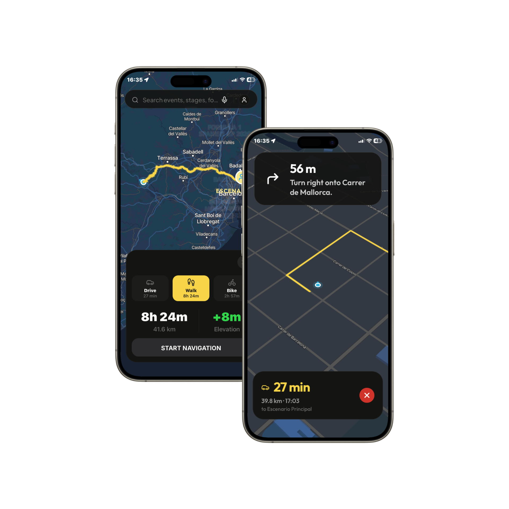

import { Callout } from 'nextra/components'

# AR Navigation HUD

The **AR Navigation HUD** (Heads-Up Display) is the centerpiece of the immersive mobile client navigation experience. It merges real-time GPS telemetry with the physical environment to provide absolute clarity to users moving through dense festival venues or racing tracks.

## Screen Mockups

  

## Interactive Design Details

*   **Vibrant Real-Time Camera Feed**: Simulates a live video feed overlaying high-visibility directive cues.
*   **3D Perspective Path Arrows**: Pulsing red arrows projected directly onto the walkable ground coordinate plane using 3D matrix scaling (`perspective-container`), adapting seamlessly to the user's camera pitch and rotation.
*   **Floating POI Pins**: Spatial anchors (e.g., *Grandstand B*, *Main Paddock*) floating above physical locations with distance indicators and auto-adjusting opacity according to distance.
*   **Crowd density notifications**: High-contrast, glassmorphism-styled toasts warn users of bottlenecks ahead (e.g., *"Crowd heavy near Gate 4"*).
*   **Unified HUD Header & Bottom Action Bar**:
    *   **Header**: High density card displaying current target (*Grandstand B*), approximate time of arrival (*3 min*), and a cancellation control.
    *   **Interactive Bottom Sheet**: Combines a mini-3D radar preview, live distance metrics (*250 meters*), context instructions (*"Continue straight past the merch stand"*), and a dynamic circular compass tracking True North.
    *   **Controls**: Floating toggle buttons to quickly swap between 2D standard mapping and the active AR camera viewport.

---

<Callout type="info">
The HTML prototype of this screen can be found in the repository at [code.html](./code.html).
</Callout>

