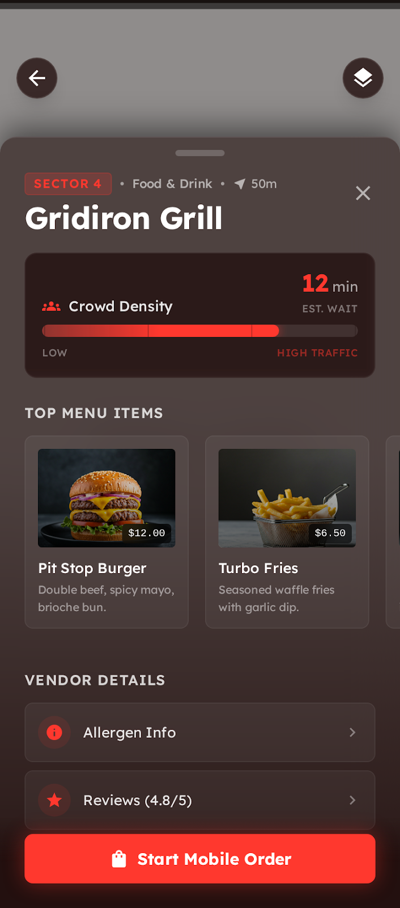

import { Callout } from "nextra/components"
# Service Detail & Wait-line

The **Service Detail & Wait-line** screen provides users with immediate, granular information regarding points of interest (POIs) such as food courts, merch stands, and amenities. It includes real-time telemetry inputs regarding crowd density and estimated wait times to help clients optimize their schedules.

## Screen Mockup

## Interactive Design Details

*   **Interactive Semi-Transparent Map Underlay**: Simulates the mobile map interface running behind a premium sliding drawer.
*   **Aesthetic Sliding Bottom Drawer**: Styled as a heavy glassmorphic sheet (`glass-panel`) with rounded corners, custom backdrop blur, and drag indicators.
*   **Wait-Line Barometer**:
    *   **Live Est. Wait**: Digital stopwatch readout (*12min Est. Wait*).
    *   **Wait Bar**: A horizontal glowing gradient bar representing crowd levels, animating from yellow/orange to primary red to represent high traffic areas.
*   **Top Menu Item Carousel**: A horizontally scrollable list showing featured products (e.g., *Pit Stop Burger*, *Turbo Fries*, *Nitro Cola*) with high-quality thumbnails, prices, and fast ingredient descriptions.
*   **Expandable Vendor Accordions**: Includes links to allergen charts and user rating reviews (e.g., *4.8/5* stars).
*   **Sticky Mobile Ordering Action**: Prominent bottom action button enabling users to **"Start Mobile Order"** immediately to bypass physical lines.

---

<Callout type="info">
> The HTML prototype of this screen can be found in the repository at [code.html](file:///home/nildiaz/app_lattice_project/docs/product/features-design/service_detail__\%26_wait-line/code.html).
