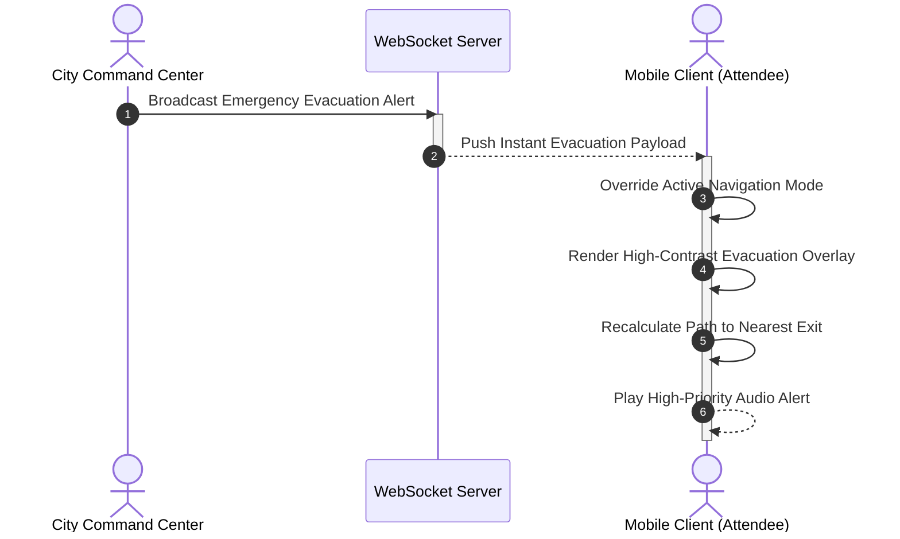

import { Callout } from 'nextra/components'

# Product Roadmap

This document outlines the strategic product vision, future technical integrations, and engineering milestones planned for the **Lattice** platform. Our goal is to transform physical event navigation into a resilient, inclusive, and high-performance smart-city layer.

---

## 1. Phase 1: Mesh Telemetry and Offline Resiliency (Short-Term: 1–3 Months)

High-density events like music festivals and sports matches frequently cause cellular network congestion, leading to service blackouts. Phase 1 focuses on ensuring the platform remains fully functional without a reliable internet connection.

### Mesh Telemetry Networks
*   **Technology**: Bluetooth Low Energy (BLE) and Wi-Fi Direct peer-to-peer routing.
*   **Feature**: Enable mobile clients to pass anonymized crowd telemetry pings peer-to-peer across nearby devices. Once a single device in the mesh chain reaches an active internet connection, it uploads the batched crowd telemetry data to the API server.

### Offline Valhalla Routing
*   **Technology**: SQLite, Protobuf tile files, and React Native native file system cache.
*   **Feature**: When users claim or purchase tickets, the mobile client pre-downloads the regional Valhalla pedestrian routing tiles for that venue. The app can then perform turn-by-turn pathfinding entirely offline, without querying the backend server.

---

## 2. Phase 2: Biometric Passkeys and Anti-Fraud Tickets (Medium-Term: 3–6 Months)

This phase focuses on enhancing ticketing security, eliminating fraudulent ticket resale, and making the entrance gate scanning experience fast and secure.

### WebAuthn Biometric Passkeys
*   **Technology**: Touch ID / Face ID, Apple iCloud Keychain, and Google Password Manager.
*   **Feature**: Replace passwords with biometric Passkeys. Users authenticate and decrypt their digital wallets using device biometrics, preventing account takeover and ensuring instant ticket access.

### Dynamic Rotating QR Codes
*   **Technology**: Time-Based One-Time Password (TOTP) algorithms.
*   **Feature**: Ticket QR codes will regenerate every 5 seconds. The generated code is cryptographically signed using the device's private key, making ticket screenshots useless for unauthorized entry and stopping fraudulent duplicate ticket sales.

---

## 3. Phase 3: Smart-City Integrations and Emergency Broadcasts (Long-Term: 6–12 Months)

Phase 3 transitions Lattice from a private event platform to a smart-city system, integrating with municipal infrastructure and emergency response networks.

### Municipal Transit Integration (Barcelona TMB API)
*   **Technology**: Barcelona Transports Metropolitans de Barcelona (TMB) API and live GTFS transit feeds.
*   **Feature**: Integrate live public transit schedules directly into the app. When an event ends, the routing engine automatically guides attendees to the nearest active Metro stations or bus lines, recalculating routes in real-time based on transit delays or overcrowding.

### Emergency Broadcast System (EBS)
*   **Technology**: WebSocket push notifications and high-priority OS overrides.
*   **Feature**: Enable city administrators and event organizers to instantly broadcast emergency alerts. During severe weather or critical incidents, the app overlays high-visibility emergency exit routes and shelter-in-place safety zones on every attendee's map view, bypassing standard routing filters.

<Callout type="info">
  **Collaboration and Standards**: All roadmap integrations adhere strictly to our **[Coding Standards](../engineering/coding-standards.md)** and **[System Architecture](../architecture/index.md)**, ensuring the codebase remains clean, secure, and maintainable.
</Callout>
