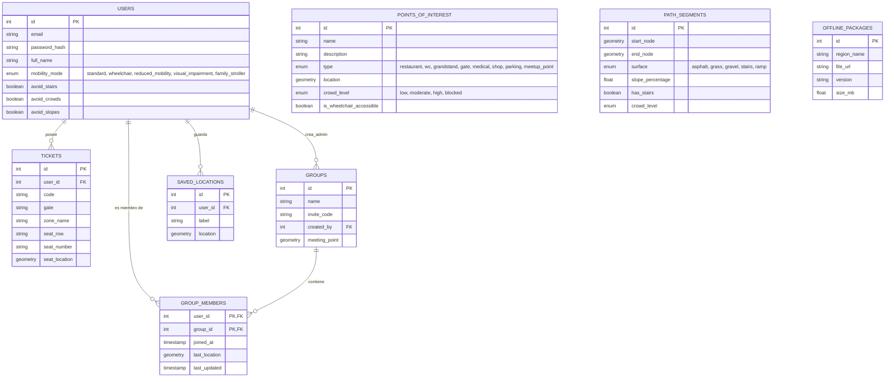

# Esquema de la Base de Datos: Lattice

Este documento detalla la estructura de datos espacial y relacional que soporta la inteligencia de Lattice.

## 1. Diagrama de Entidad-Relación (ERD)

Este diagrama representa las principales entidades y sus relaciones.

## 2. Consideraciones Geoespaciales (PostGIS)

- **Tipos de Geometría**: Utilizamos `GEOMETRY(Point, 4326)` para puntos de interés y ubicaciones, y `GEOMETRY(LineString, 4326)` para segmentos de ruta.
- **Indexación**: Todas las columnas de geometría cuentan con índices GIST para optimizar las consultas de proximidad.
