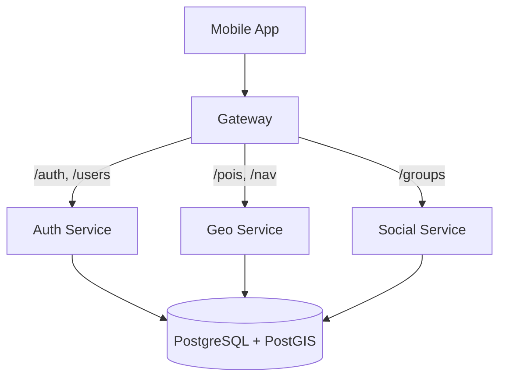

# Backend Architecture & Infrastructure

The Lattice backend is a containerized microservices architecture designed for high availability, performance, and fault isolation in high-traffic environments.

## System Components

### 1. API Gateway (`apps/server/gateway`)

The single entry point for all mobile traffic.

- **Responsibility:** Request routing, central security, Rate Limiting, and protocol abstraction.
- **Port:** 3000

### 2. Auth Service (`apps/server/auth`)

Handles user identity and ticket synchronization.

- **Responsibility:** QR ticket linking, user profile management (accessibility preferences), and JWT issuing.
- **Port:** 3001

### 3. Geo Service (`apps/server/geo`)

The spatial brain of the application.

- **Responsibility:** POI delivery (Grandstands, Food, Restrooms), accessibility-aware routing, and personal waypoint storage.
- **Port:** 3002

### 4. Social Service (`apps/server/social`)

Manages real-time interactions.

- **Responsibility:** Group management and high-frequency real-time location sharing via WebSockets (`Socket.io`).
- **Port:** 3003

## Infrastructure & Docker

The entire backend environment is orchestrated via **Docker Compose** to ensure parity between development and production.

### Caching & Persistence Strategy

We implement a **Dual-Storage** pattern to balance speed and reliability:

1.  **Drizzle ORM + PostgreSQL:**
    - **Role:** Source of Truth.
    - **Data:** Users, Tickets, POI master data, and historical logs.
    - **Usage:** Used for all operations requiring persistence and complex relational queries.
2.  **Redis (ioRedis):**
    - **Role:** Speed Layer & Message Broker.
    - **Data:** Real-time telemetry (GPS), active session metadata, and high-frequency cache.
    - **Usage:** Services query Redis first for ephemeral data. Periodic "background syncs" may persist critical data from Redis to PostgreSQL using Drizzle.

---

### Deployment Environment

- **Containerization:** Multi-stage Docker builds for all custom services to optimize image size.
- **Networking:** Internal bridge network for inter-service communication; external traffic is strictly limited to the Gateway.

---

> For setup instructions, see the [**Developer Setup Guide**](/guides/setup).
