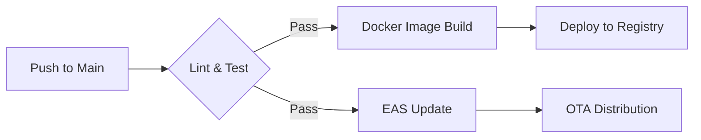

# Deployment & CI/CD Guide

This document outlines the production deployment process for the Lattice ecosystem.

## 1. Backend API (Node.js + PostGIS)

Our backend services are deployed as Docker containers.

### Infrastructure Requirements

- **Runtime:** Docker-compatible engine (AWS ECS, DigitalOcean App Platform, etc.).
- **Database:** PostgreSQL 15+ with PostGIS enabled.
- **Networking:** SSL/TLS is mandatory. Load balancers must support persistent WebSocket connections.

### Environment Variables (Production)

| Variable       | Description                   |
| :------------- | :---------------------------- |
| `DATABASE_URL` | Production connection string  |
| `JWT_SECRET`   | Secure key for authentication |
| `NODE_ENV`     | Must be set to `production`   |

## 2. Mobile Application (Expo EAS)

We use **Expo Application Services (EAS)** for builds and distribution.

### Build Profiles (`eas.json`)

- **`preview`:** For internal testing and stakeholders.
- **`production`:** Final builds for App Store and Google Play.

```bash
# Example build command
eas build --platform android --profile production
```

### Over-the-Air (OTA) Updates

We use `expo-updates` to push critical bug fixes and UI adjustments instantly during event weekends without waiting for Store reviews.

## 3. CI/CD Pipeline



---

> [!CAUTION]
> Always verify migration logs after a backend deployment to ensure spatial indices and PostGIS schemas are intact.
