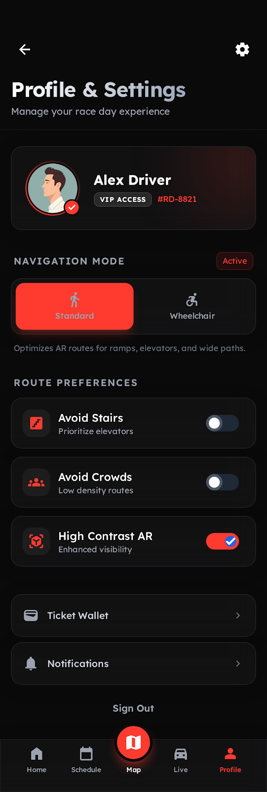

# Profile & Accessibility

The **Profile & Accessibility** page serves as the configuration control room for the client's spatial routing. It allows users to personalize their personal profile and declare mobility restrictions, which are dynamically evaluated by the backend pathfinder.

## Screen Mockup

## Interactive Design Details

*   **Glowing VIP User Card**: Displays a high-density profile element containing the user's avatar, verification checks, access tags (*VIP Access*), and serial tracking IDs.
*   **Tactile Mobility Mode Switch**:
    *   **Standard Mode**: For users with standard mobility, optimizing routes purely for velocity.
    *   **Wheelchair Mode**: Triggers a critical layout shift that updates path calculations, bypassing architectural barriers such as stairs, escalators, and steep pavement.
*   **Accessibility Preference Toggles**:
    *   **Avoid Stairs**: Toggles elevator/ramp prioritization logic.
    *   **Avoid Crowds**: Filters route paths based on live telemetry heatmaps to dodge packed sections.
    *   **High Contrast AR**: Heightens color saturation and line weights inside the AR camera overlay to support visually impaired clients.
*   **Wallet & Alert Settings Grid**: Elegant list group items allowing users to access ticket wallets or customize push notifications.
*   **Aesthetic Fixed Tab Bar**: Keeps the highlighted *Profile* icon lit in red to represent the current app state.

---

> [!TIP]
> The HTML prototype of this screen can be found in the repository at [code.html](file:///home/nildiaz/app_lattice_project/docs/product/features-design/profile__\%26_accessibility/code.html).
